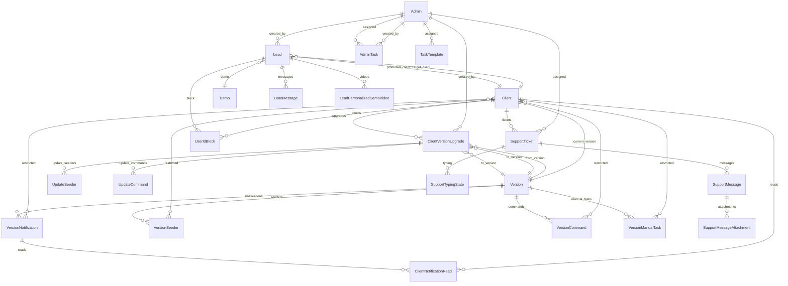

# admin-api — Contexto del proyecto

Backend **Laravel 8** del panel administrativo de ComercioCity. Gestiona clientes (`empresa-api` desplegados), versiones del producto, actualizaciones remotas, leads comerciales, soporte tipo bandeja y tareas internas. Se consume principalmente desde **admin-spa** (API JSON + Sanctum) y mantiene un panel **Blade** legacy con sesión web.

**Stack:** PHP 7.3|8.0, Laravel 8, Sanctum 2, CORS (fruitcake), Pusher (broadcasting), Guzzle (HTTP a `empresa-api` clientes).

---

## Estructura de carpetas principal

```
admin-api/
├── app/
│   ├── Console/
│   │   ├── Commands/          # Comandos artisan (followups, demo reminders, retry sync soporte)
│   │   └── Kernel.php         # Schedule de tareas recurrentes
│   ├── Events/                # Broadcasting (soporte, sugerencias de lead)
│   ├── Http/
│   │   ├── Controllers/
│   │   │   ├── Api/           # Auth, meta, soporte, inbound, admin list
│   │   │   ├── Auth/          # Login Blade (sesión web)
│   │   │   ├── CommonLaravel/ # Search, mass-update, BaseController, helpers
│   │   │   └── *.php          # CRUD Blade + métodos *_json para SPA
│   │   └── Middleware/
│   ├── Mail/                  # Mailables ComercioCity (demo, presentación, propuesta, seguimiento)
│   ├── ModelProperties/       # Esquemas declarativos de columnas para admin-spa (meta)
│   ├── Models/
│   │   └── Concerns/          # HasUuid, RestrictsToClients
│   ├── Providers/
│   └── Services/              # Lógica de negocio (promoción lead, setups, versiones, IA, soporte)
├── bootstrap/
├── config/                    # app, auth, cors, commerciocity, services, broadcasting, …
├── database/
│   ├── migrations/
│   ├── factories/
│   └── seeders/
├── deploy/
├── public/                    # Front controller Laravel
├── resources/
│   └── views/                 # Vistas Blade del panel legacy
├── routes/
│   ├── api.php                # API JSON (prefijo /api)
│   ├── web.php                # Panel Blade (sesión)
│   ├── channels.php
│   └── console.php
├── storage/
└── tests/
```

**Prefijo HTTP:** todas las rutas de `routes/api.php` se montan bajo `/api` (`RouteServiceProvider`).

---

## Modelos y relaciones

### Diagrama resumido



### Catálogo de modelos

| Modelo | Tabla | Relaciones principales | Notas |
|--------|-------|------------------------|-------|
| **Admin** | `admins` | `hasMany` SupportTicket | Authenticatable + Sanctum; `properties()` vía AdminProperties |
| **Client** | `clients` | `belongsTo` Version (current_version); `hasMany` upgrades, notification_reads | UUID; `api_url`, `api_key`, `inbound_api_key`; instancia empresa-api |
| **Version** | `versions` | `hasMany` notifications, seeders, commands, manual_tasks, upgrades | UUID; publicación de releases |
| **VersionNotification** | `version_notifications` | `belongsTo` Version; `morphToMany` Client (restricted); `hasMany` reads | Trait `RestrictsToClients` |
| **VersionSeeder** | `version_seeders` | `belongsTo` Version; `morphToMany` Client | Idem restricción por cliente |
| **VersionCommand** | `version_commands` | `belongsTo` Version; `morphToMany` Client | Idem |
| **VersionManualTask** | `version_manual_tasks` | `belongsTo` Version; `morphToMany` Client | Idem |
| **ClientVersionUpgrade** | `client_version_upgrades` | `belongsTo` Client, from_version, to_version, created_by_admin; `hasMany` update_seeders, update_commands | En rutas SPA el recurso se llama `update` |
| **UpdateSeeder** | `update_seeders` | `belongsTo` ClientVersionUpgrade, VersionSeeder | Estado por ítem de migración/seeder |
| **UpdateCommand** | `update_commands` | `belongsTo` ClientVersionUpgrade, VersionCommand | Estado por comando artisan |
| **ClientNotificationRead** | `client_notification_reads` | `belongsTo` Client, VersionNotification | Sincronizado desde empresa-api (inbound) |
| **Lead** | `leads` | `belongsTo` target_client, promoted_client, created_by_admin, Demo; `hasMany` messages, personalized_demo_videos | UUID; pipeline comercial + setup demo/producción |
| **LeadMessage** | `lead_messages` | `belongsTo` Lead | Conversación WhatsApp + sugerencias IA |
| **LeadPersonalizedDemoVideo** | `lead_personalized_demo_videos` | `belongsTo` Lead | Videos del mail de demo |
| **LeadPipelineStatus** | `lead_pipeline_statuses` | — (catálogo por `slug`) | Estados del pipeline; sin FK desde Lead (`status` string) |
| **Demo** | `demos` | — | Catálogo de demos asignables a leads |
| **FollowupRule** | `followup_rules` | — | Reglas automáticas de seguimiento por estado |
| **ProtocolEntry** | `protocol_entries` | — | Protocolos/scripts comerciales |
| **AiSystemPrompt** | `ai_system_prompts` | — | Prompt activo para Claude (leads) |
| **SupportTicket** | `support_tickets` | `belongsTo` Client, assigned_admin; `hasMany` messages; `hasOne` lastMessage | UUID; bandeja soporte |
| **SupportMessage** | `support_messages` | `belongsTo` Ticket; `belongsTo` sender_admin; `hasMany` attachments | UUID; sync remoto a empresa-api |
| **SupportMessageAttachment** | `support_message_attachments` | `belongsTo` SupportMessage | |
| **SupportTypingState** | `support_typing_states` | `belongsTo` SupportTicket | Indicador “escribiendo…” |
| **AdminTask** | `admin_tasks` | `belongsTo` created_by_admin, assigned_admin | Tareas internas del panel |
| **TaskTemplate** | `task_templates` | `belongsTo` assigned_admin | Plantillas al disparar procesos (ej. `lead_a_cliente`) |
| **AdminColumnPreference** | `admin_column_preferences` | — | Preferencias de columnas del SPA por admin + modelo |
| **UserIdBlock** | `user_id_blocks` | `belongsTo` Lead, Client | Reserva bloques de `user_id` (múltiplos de 100) |

### Traits / concerns

- **`HasUuid`:** route key `uuid` en Client, Version, ClientVersionUpgrade, Lead, Demo, SupportTicket, SupportMessage, etc.
- **`RestrictsToClients`:** pivote `version_item_clients` (morph `version_item`). Sin filas en pivote = aplica a todos los clientes.

### Alias de modelo en rutas

`GeneralHelper::getModelName()` resuelve nombres cortos a FQCN. Alias explícito: `update` → `App\Models\ClientVersionUpgrade`.

---

## Rutas de la API

Base: **`/api`**. Dos superficies: **inbound** (empresa-api → admin-api) y **admin** (admin-spa).

### Inbound — `middleware: admin.inbound.key`

| Método | Ruta | Controlador | Descripción |
|--------|------|-------------|-------------|
| POST | `/api/inbound/notification-reads` | `Api\InboundReadController@store` | Lecturas de notificaciones de versión |
| POST | `/api/inbound/support/messages` | `Api\InboundSupportMessageController@store` | Mensaje de soporte desde cliente |
| POST | `/api/inbound/support/messages/read` | `Api\InboundSupportMessageController@mark_read` | Marcar mensaje leído |
| POST | `/api/inbound/support/typing` | `Api\InboundSupportMessageController@typing` | Estado “escribiendo” |

Autenticación: header `X-Admin-Api-Key` (si `ADMIN_INBOUND_REQUIRE_API_KEY=true`) o resolución por `client_uuid` / `message_uuid` / `ticket_uuid`.

### Admin SPA — prefijo `/api/admin`

#### Público

| Método | Ruta | Acción |
|--------|------|--------|
| POST | `/api/admin/login` | Login → token Sanctum `admin-spa` |

#### Protegido — `middleware: auth:sanctum`

| Método | Ruta | Recurso / acción |
|--------|------|------------------|
| POST | `/api/admin/logout` | Cerrar sesión (revoca token) |
| GET | `/api/admin/me` | Perfil admin autenticado |
| PUT | `/api/admin/me` | Actualizar perfil (flags default soporte/tareas) |
| GET | `/api/admin/meta/{model}` | Esquema `properties()` del modelo |
| GET/PUT | `/api/admin/column-preferences/{model}` | Preferencias de columnas |
| POST | `/api/admin/search/{model}/null/1` | Búsqueda/filtros (proxy) |
| POST | `/api/admin/search-from-modal/{model}` | Búsqueda modal |
| POST | `/api/admin/mass-update/{model}` | Actualización masiva |
| GET/POST/PUT/DELETE | `/api/admin/version`, `/version/{id}` | CRUD Version |
| GET/POST/PUT/DELETE | `/api/admin/client`, `/client/{id}` | CRUD Client |
| GET/POST/PUT/DELETE | `/api/admin/lead`, `/lead/{id}` | CRUD Lead |
| POST | `/api/admin/lead/{id}/send-presentation-mail` | Mail presentación |
| POST | `/api/admin/lead/{id}/send-followup-mail` | Mail seguimiento |
| POST | `/api/admin/lead/{id}/run-demo-setup` | Setup demo remoto |
| POST | `/api/admin/lead/{id}/promote` | Promover lead (legacy) |
| POST | `/api/admin/lead/{id}/promote-to-client` | Promover a Client producción |
| POST | `/api/admin/lead/{id}/run-user-setup` | Setup usuario producción |
| POST | `/api/admin/lead/{id}/send-demo-mail` | Mail demo |
| POST | `/api/admin/lead/{id}/messages` | Alta mensaje conversación |
| POST | `/api/admin/lead/{id}/mark-followup-suggestion-seen` | Marcar sugerencia vista |
| PUT | `/api/admin/lead-message/{id}/approve` | Aprobar sugerencia IA |
| PUT | `/api/admin/lead-message/{id}/approve-with-edit` | Aprobar con edición |
| PUT | `/api/admin/lead-message/{id}/reject` | Rechazar sugerencia |
| GET | `/api/admin/followup-rule` | Listar reglas |
| PUT | `/api/admin/followup-rule/{id}` | Actualizar regla |
| GET/PUT | `/api/admin/ai-system-prompt` | Prompt IA activo |
| GET/POST/PUT/DELETE/PATCH | `/api/admin/protocol-entry`, `.../toggle-activa` | Protocolos |
| GET/POST/PUT/DELETE | `/api/admin/demo`, `/demo/{id}` | CRUD Demo |
| GET/POST/PUT/DELETE | `/api/admin/update`, `/update/{id}` | CRUD upgrades (ClientVersionUpgrade) |
| GET | `/api/admin/update/{id}/extra-data` | Datos extra del upgrade |
| POST | `/api/admin/update/{id}/advance-status` | Avanzar estado |
| POST | `/api/admin/update/{id}/mark-step` | Marcar paso manual |
| POST | `/api/admin/update/{id}/sync` | Sincronizar a cliente |
| POST | `/api/admin/update/{id}/seeders/{seeder}/mark` | Marcar seeder |
| POST | `/api/admin/update/{id}/commands/{command}/mark` | Marcar comando |
| GET | `/api/admin/admin` | Lista admins (selectores) |
| GET/POST/PUT/DELETE/PATCH | `/api/admin/task-template`, toggle/move | Plantillas de tareas |
| GET/POST/PUT/DELETE | `/api/admin/task`, `PUT .../task/reorder` | Tareas internas |
| GET/POST/PUT | `/api/admin/support-ticket`, unread-badges, `{id}` | Bandeja soporte |
| POST | `/api/admin/support-ticket/{ticket_id}/message` | Enviar mensaje |
| POST | `/api/admin/support-message/{id}/retry-remote-sync` | Reintentar sync |
| POST | `/api/admin/support-message/{id}/mark-read` | Marcar leído |
| POST | `/api/admin/support-ticket/{ticket_id}/typing` | Typing admin |
| GET | `/api/admin/task_template` | Alias legacy plantillas |

Respuestas JSON típicas: `{ "models": ... }` en listados, `{ "model": ... }` en show/store/update.

### Panel web Blade — `routes/web.php` (sin prefijo `/api`)

| Área | Rutas | Auth |
|------|-------|------|
| Auth | `GET/POST /login`, `POST /logout` | guest / auth |
| Versions | `Route::resource('versions', ...)` + notifications, seeders, commands, manual-tasks, publish | `auth` (sesión) |
| Clients | `resource clients` | `auth` |
| Leads | `resource leads` + mails, demo-setup, promote, user-setup, preview-demo-mail | `auth` |
| Updates | `updates/*` (index, create, store, show, advance, mark-step, sync) | `auth` |

`RouteServiceProvider::HOME` = `/versions`.

---

## Middlewares y autenticación

### Stack global (`app/Http/Kernel.php`)

TrustProxies, HandleCors, PreventRequestsDuringMaintenance, TrimStrings, ConvertEmptyStringsToNull.

### Grupos

| Grupo | Uso | Middleware relevante |
|-------|-----|----------------------|
| `web` | Panel Blade | Session, CSRF, cookies |
| `api` | JSON | `throttle:api` (60/min por user o IP), SubstituteBindings |

### Route middleware

| Alias | Clase | Uso |
|-------|-------|-----|
| `auth` | `Authenticate` | Sesión web; redirect a `login` si no JSON |
| `auth:sanctum` | Sanctum | API admin-spa (Bearer token) |
| `guest` | `RedirectIfAuthenticated` | Login Blade |
| `admin.inbound.key` | `AdminInboundKey` | Callbacks desde empresa-api |

### Autenticación dual

1. **admin-spa:** modelo `Admin` + **Laravel Sanctum** (`HasApiTokens`). Login en `AuthController@login` crea token `admin-spa` (revoca anteriores del mismo nombre). Header: `Authorization: Bearer {token}`.
2. **Panel Blade:** guard `web` + provider `users` → `App\Models\Admin` (sesión).

### Inbound (`AdminInboundKey`)

- Con `ADMIN_INBOUND_REQUIRE_API_KEY=true`: valida `X-Admin-Api-Key` contra `clients.inbound_api_key` (cliente activo).
- Con `false`: resuelve `Client` por `client_uuid`, `message_uuid` o `ticket_uuid`.
- Adjunta `sync_client` en `$request->attributes`.

### CORS

`config/cors.php`: orígenes desde `ADMIN_SPA_URL` (lista separada por coma). Paths: `api/*`, `sanctum/csrf-cookie`.

### Rate limiting

`api`: 60 requests/minuto por `user()->id` o IP.

---

## Servicios y clases relevantes

| Clase | Responsabilidad |
|-------|-----------------|
| **PromoteLeadService** | Flujo de promoción lead → cliente (orquestación) |
| **PromoteLeadToClientService** | Creación del `Client` de producción y vínculos |
| **RunDemoSetupService** | Llama API remota del `target_client` para demo setup |
| **RunUserSetupService** | Setup de usuario en sistema productivo post-promoción |
| **UserIdBlockAllocatorService** | Asignación de bloques `user_id` (múltiplos de 100) |
| **PublishVersionService** | Publicar versión y propagar a clientes |
| **VersionPathService** | Rutas/archivos de artefactos de versión |
| **VersionNestedJsonSync** | Sincronización JSON anidada de ítems de versión |
| **RegisterNotificationReadService** | Registro de lecturas de notificaciones |
| **LeadFollowupService** | Seguimientos automáticos según `FollowupRule` |
| **LeadAiService** | Integración Anthropic (sugerencias de mensajes) |
| **LeadWhatsAppPasteCleaner** | Normalización de texto pegado desde WhatsApp |
| **SupportClientSyncService** | Sync de mensajes de soporte hacia empresa-api |
| **SupportTicketAssignmentService** | Asignación de tickets (default owner admin) |
| **TaskFromTemplatesService** | Genera `AdminTask` desde `TaskTemplate` por proceso |

### Events (broadcasting / tiempo real)

- `SupportMessageReceived`, `SupportMessageRead`, `SupportTicketUpdated`, `LeadSuggestionCreated`

### Mail

- `LeadDemoMail`, `LeadProposalMail`, `ComercioCityMail` + helpers en `app/Mail/Helpers/`
- Config de marca y contenidos: `config/commerciocity.php`

### CommonLaravel (patrón compartido con empresa-api)

- `BaseController` — `fullModel()`, `userId()` siempre `null` (sin multi-tenant)
- `SearchController` — filtros `filters[]` compatibles con admin-spa
- `ModelPropertiesHelper` — validación/mapeo de propiedades declarativas
- `GeneralHelper` — resolución de nombres de modelo

### Comandos programados (`app/Console/Kernel.php`)

| Comando | Frecuencia |
|---------|------------|
| `support:retry-pending-syncs` | Cada 5 min |
| `leads:check-followups` | Cada 2 h |
| `leads:send-demo-reminders` | Cada 5 min |

Otros: `CheckLeadFollowups`, `SendDemoReminders`, `SupportRetryPendingSyncs`, `TestLeadFollowup`.

---

## Convenciones de código

### Naming

- Métodos y propiedades en **`snake_case`** (p. ej. `index_json`, `send_presentation_mail`, `run_demo_setup_json`).
- Identificadores en **inglés**; comentarios y mensajes al usuario en **español**.
- Tablas en plural snake_case; modelos en singular PascalCase.

### Controladores API (SPA)

- Métodos sufijo **`_json`** para endpoints consumidos por admin-spa (`index_json`, `store_json`, …).
- Respuestas: `['models' => $collection]` o `['model' => $item]`, HTTP 200/4xx con `message` en errores.
- Muchos controladores extienden **`BaseController`** y usan **`fullModel($model_name, $id)`** con scope **`scopeWithAll`** cuando existe.

### Modelos Eloquent

- **`protected $guarded = []`** habitual.
- Modelos con UI declarativa implementan **`public static function properties()`** delegando a `app/ModelProperties/*Properties.php`.
- Scope vacío o con eager load: **`scopeWithAll($query)`** (convención obligatoria del proyecto).
- UUIDs: trait **`HasUuid`**, route binding por `uuid` donde aplica.
- Relaciones Eloquent en **snake_case** (`target_client`, `promoted_client`, `created_by_admin`).

### Sin multi-tenant

A diferencia de `empresa-api`, **`userId()` retorna `null`**; no se filtra por `user_id` en queries globales.

### Integración con empresa-api (clientes)

Cada **`Client`** representa una instancia desplegada:

- `api_url` + `api_key` — llamadas salientes (setups, sync soporte).
- `inbound_api_key` — validación inbound.
- `user_id` — inicio de bloque ComercioCity alineado con `User` en empresa-api.

### Migraciones

- **No se agregan foreign keys** en migraciones nuevas; relaciones solo en Eloquent.

### Comentarios

- PHPDoc en métodos nuevos/modificados: propósito, parámetros, retorno.
- Comentarios en español en lógica de negocio no obvia.

### HTTP saliente a clientes

- Timeout/reintentos: `config('services.client_api')` ← `CLIENT_API_TIMEOUT`, `CLIENT_API_RETRIES`.

---

## Variables de entorno relevantes

Solo nombres (sin valores). Agrupadas por ámbito.

### Aplicación y entorno

- `APP_NAME`, `APP_ENV`, `APP_KEY`, `APP_DEBUG`, `APP_URL`, `ASSET_URL`
- `ADMIN_SPA_URL` — orígenes CORS del SPA (coma-separados)

### Logs

- `LOG_CHANNEL`, `LOG_DEPRECATIONS_CHANNEL`, `LOG_LEVEL`

### Base de datos

- `DB_CONNECTION`, `DB_HOST`, `DB_PORT`, `DB_DATABASE`, `DB_USERNAME`, `DB_PASSWORD`

### Cache, sesión, colas, archivos

- `BROADCAST_DRIVER`, `CACHE_DRIVER`, `FILESYSTEM_DRIVER`, `QUEUE_CONNECTION`
- `SESSION_DRIVER`, `SESSION_LIFETIME`, `SESSION_CONNECTION`, `SESSION_STORE`, `SESSION_DOMAIN`, `SESSION_SECURE_COOKIE`
- `MEMCACHED_HOST`
- `REDIS_HOST`, `REDIS_PASSWORD`, `REDIS_PORT`, `REDIS_QUEUE`

### Mail

- `MAIL_MAILER`, `MAIL_HOST`, `MAIL_PORT`, `MAIL_USERNAME`, `MAIL_PASSWORD`, `MAIL_ENCRYPTION`, `MAIL_FROM_ADDRESS`, `MAIL_FROM_NAME`
- `MAILGUN_DOMAIN`, `MAILGUN_SECRET`, `MAILGUN_ENDPOINT`
- `POSTMARK_TOKEN`

### AWS / SQS (opcional)

- `AWS_ACCESS_KEY_ID`, `AWS_SECRET_ACCESS_KEY`, `AWS_DEFAULT_REGION`, `AWS_BUCKET`, `AWS_USE_PATH_STYLE_ENDPOINT`
- `SQS_PREFIX`, `SQS_QUEUE`, `SQS_SUFFIX`
- `QUEUE_FAILED_DRIVER`

### Broadcasting (Pusher / Ably)

- `PUSHER_APP_ID`, `PUSHER_APP_KEY`, `PUSHER_APP_SECRET`, `PUSHER_APP_CLUSTER`
- `PUSHER_GUZZLE_VERIFY_SSL`, `PUSHER_GUZZLE_CA_BUNDLE`
- `MIX_PUSHER_APP_KEY`, `MIX_PUSHER_APP_CLUSTER`
- `ABLY_KEY`

### Sanctum

- `SANCTUM_STATEFUL_DOMAINS`

### Integración admin ↔ empresa-api

- `ADMIN_INBOUND_REQUIRE_API_KEY` — exigir `X-Admin-Api-Key` en inbound
- `CLIENT_API_TIMEOUT`, `CLIENT_API_RETRIES` — HTTP saliente a clientes

### Anthropic (IA en leads)

- `ANTHROPIC_API_KEY`, `ANTHROPIC_MODEL`, `ANTHROPIC_CAINFO`, `ANTHROPIC_VERIFY_SSL`

### Marca y correos ComercioCity (`config/commerciocity.php`)

- `COMMERCIOCITY_BRAND_NAME`, `COMMERCIOCITY_LOGO_URL`, `COMMERCIOCITY_HEADER_BG`
- `COMMERCIOCITY_WEBSITE_URL`, `COMMERCIOCITY_INSTAGRAM_URL`, `COMMERCIOCITY_WEBSITE_LABEL`, `COMMERCIOCITY_INSTAGRAM_LABEL`, `COMMERCIOCITY_FOOTER_LEGAL_HTML`
- `COMMERCIOCITY_PRESENTER_NAME`, `COMMERCIOCITY_PRESENTER_ROLE`, `COMMERCIOCITY_PRESENTER_AVATAR_URL`
- `COMMERCIOCITY_PRESENTATION_VIDEO_URL`, `COMMERCIOCITY_PRESENTATION_VIDEO_THUMBNAIL_URL`, `COMMERCIOCITY_PRESENTATION_VIDEO_CAPTION`
- `COMMERCIOCITY_PRESENTATION_CTA_TEXT`, `COMMERCIOCITY_PRESENTATION_CTA_URL`
- `COMMERCIOCITY_FOLLOWUP_PROPOSAL_URL`
- `COMMERCIOCITY_FOLLOWUP_TESTIMONIAL_VIDEO_URL`, `COMMERCIOCITY_FOLLOWUP_TESTIMONIAL_VIDEO_THUMBNAIL_URL`, `COMMERCIOCITY_FOLLOWUP_TESTIMONIAL_VIDEO_CAPTION`
- `COMMERCIOCITY_FOLLOWUP_TESTIMONIAL_INSTAGRAM_CTA_TEXT`, `COMMERCIOCITY_FOLLOWUP_TESTIMONIAL_INSTAGRAM_CTA_URL`
- `COMMERCIOCITY_FOLLOWUP_CTA_TEXT`, `COMMERCIOCITY_FOLLOWUP_CTA_URL`
- `COMMERCIOCITY_PROPOSAL_WHATSAPP_URL`, `COMMERCIOCITY_PROPOSAL_URGENCY_HOURS`, `COMMERCIOCITY_PROPOSAL_PRESENTER_NAME`, `COMMERCIOCITY_PROPOSAL_PRESENTER_ROLE`, `COMMERCIOCITY_PROPOSAL_DETAIL_VIDEO_URL`
- `COMMERCIOCITY_PROPOSAL_BASE_PRICE`, `COMMERCIOCITY_PROPOSAL_DISCOUNT_PRICE`, `COMMERCIOCITY_PROPOSAL_SAVING_AMOUNT`, `COMMERCIOCITY_PROPOSAL_INSTALLMENT_AMOUNT`
- `COMMERCIOCITY_DEMO_PASSWORD`, `COMMERCIOCITY_DEMO_WHATSAPP_URL`, `COMMERCIOCITY_DEMO_PRESENTER_NAME`, `COMMERCIOCITY_DEMO_PRESENTER_ROLE`
- `COMMERCIOCITY_DEMO_VIDEO_INTRO`, `COMMERCIOCITY_DEMO_VIDEO_STOCK`, `COMMERCIOCITY_DEMO_VIDEO_VENTAS`, `COMMERCIOCITY_DEMO_VIDEO_ECOMMERCE`, `COMMERCIOCITY_DEMO_VIDEO_CIERRE`

### Desarrollo / tooling (opcional)

- `TINKER_TRUST_PROJECT`, `IGNITION_*`, `FLARE_KEY`, `REGISTER_IGNITION_COMMANDS`

---

## Relación con el resto del workspace

- **empresa-api:** cada `Client` en admin-api es una instancia desplegada; callbacks inbound y sync de soporte/notificaciones.
- **admin-spa:** consumidor principal de `/api/admin/*` con Sanctum.
- **tienda-api / tienda-spa:** comparten filosofía de producto pero **no** este código; admin-api es panel interno ComercioCity.

Tras cambiar variables de entorno en producción: `php artisan config:clear` (o `config:cache`).
